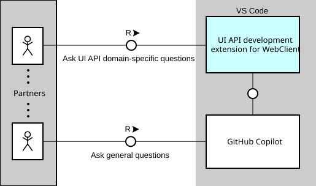
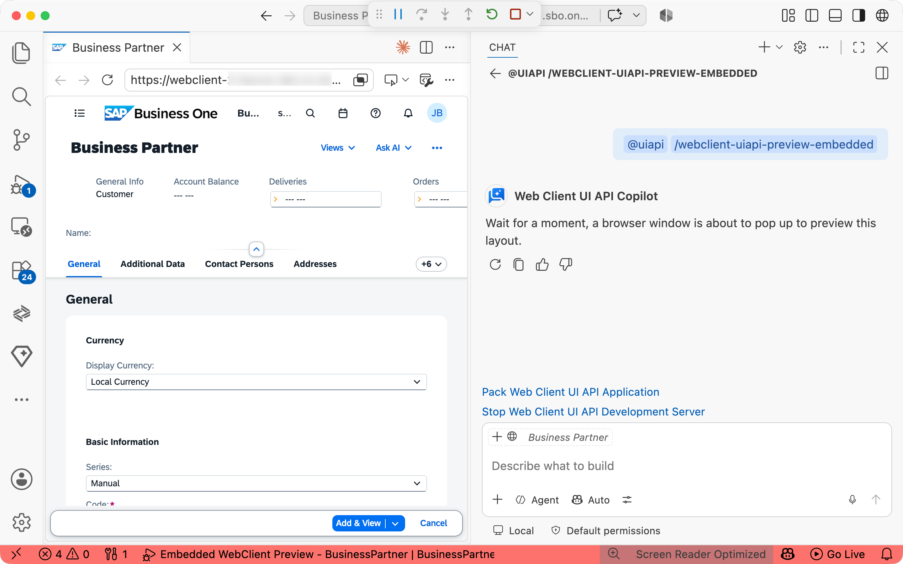

# UI API development extension for SAP Business One, Web client


- [UI API development extension for SAP Business One, Web client](#ui-api-development-extension-for-sap-business-one-web-client)
  - [Introduction](#introduction)
  - [Features](#features)
    - [Guided Workflows (Skills)](#guided-workflows-skills)
    - [Developer Commands](#developer-commands)
    - [Language Model Tools](#language-model-tools)
      - [Service Layer Metadata Querying](#service-layer-metadata-querying)
      - [Assist in UI Layout Declaration](#assist-in-ui-layout-declaration)
      - [Automate GUID generation](#automate-guid-generation)
    - [Documentation Search](#documentation-search)
    - [Coding Assistance](#coding-assistance)
  - [Requirements](#requirements)
    - [Prerequisites](#prerequisites)
    - [Dependencies](#dependencies)
  - [Setup](#setup)
    - [Build from Source](#build-from-source)
    - [Run in Development Mode](#run-in-development-mode)
    - [Run Tests](#run-tests)
    - [Installation](#installation)
      - [Local Installation](#local-installation)
      - [Marketplace Installation](#marketplace-installation)
  - [Getting Started](#getting-started)
    - [Create Your First App](#create-your-first-app)
    - [Run Your App](#run-your-app)
    - [Develop Your App with AI Assistance](#develop-your-app-with-ai-assistance)
    - [Package Your App](#package-your-app)
  - [Configuration and Settings](#configuration-and-settings)
  - [Logs For Troubleshooting](#logs-for-troubleshooting)

## Introduction

UI API development extension for SAP Business One Web client (also known as `Web Client UI API Copilot`) is a VS Code extension that brings AI-powered assistance to [SAP Business One Web Client UI API](https://help.sap.com/docs/SAP_BUSINESS_ONE_WEB_CLIENT/e6ac71d18c7543828bd4463f77d67ff7/91136d4d359f427e973260dd401dec1e.html?version=10.0_SP_2605&state=DRAFT&ai=true) development by leveraging GitHub Copilot's AI capabilities. It acts as a GitHub Copilot chat participant for the specific UI API domain and, by contributing language model tools, it provides guided workflows, development tooling, metadata access, and code generation, to help partners build Web Client UI API extensions efficiently.



**Note**: This extension is designed for UI API **TypeScript** projects. It cannot work with JavaScript projects.

## Features

The extension follows a **skill-first, tool-second** design: skills handle multi-step guided workflows, while language model tools provide the atomic capabilities that both skills and open-ended chat queries draw on.

### Guided Workflows (Skills)

Invoke a skill by name or describe what you want — GitHub Copilot will route your request to the right skill automatically. Each skill drives an interactive conversation to collect required information, confirms the parameters with you, then generates the output.

| Skill | Description |
|---|---|
| `/webclient-uiapi-create-app` | Scaffold a complete new UI API application — folder structure, manifest, controllers, layouts, and deployment descriptor |
| `/webclient-uiapi-add-module` | Add a new module (with one or more views) to an existing application |
| `/webclient-uiapi-add-view` | Add a new view to an existing module |
| `/webclient-uiapi-add-dialog` | Add a dialog to an existing module |


### Developer Commands

Available from the `@uiapi` chat participant, these commands provide quick access to common development tasks, such as starting/stopping the local development server, previewing the app, packaging for deployment, and inspecting the Web Client UI Control.



| Command | Description |
|---|---|
| `/webclient-uiapi-start` | Start the local development server |
| `/webclient-uiapi-stop` | Stop the local development server |
| `/webclient-uiapi-preview` | Preview the app in an external browser (Chrome) |
| `/webclient-uiapi-preview-embedded` | Preview the app in VS Code's embedded browser |
| `/webclient-uiapi-package` | Package the application into a deployable MTAR archive |
| `/webclient-uiapi-inspect` | Inspect a Web Client UI control and extract the stable control GUID |

**Note:** The chat `@uiapi` participant was originally designed for the GitHub Copilot **Ask** mode. However, with the continuous evolution of GitHub Copilot, it has been shifting its focus strategically toward **Agent** mode, making **Ask** mode less powerful than before. It is strongly recommended to use the default Agent mode for a better experience and more capabilities.


### Language Model Tools

These tools provide atomic, reusable capabilities (metadata lookup, schema retrieval, UUID generation, coding assistance) that both skills and ad-hoc chat queries use. Below are some of the key tools that are available in this extension.

#### Service Layer Metadata Querying

When developing with UI API extensions, accessing SAP Business One Service Layer is a common operation. To offer a seamless programming experience, the extension bundles a static SAP Business One Service Layer metadata file and exposes it through a set of tools, enabling the AI to answer precise questions about business objects and assist in building OData queries — without any network round-trip at runtime.

- **List entity sets** — returns all available OData EntitySets
- **Get entity set detail** — returns full entity metadata: key properties, all properties, bound and unbound functions
- **Validate entity properties** — confirms that a given list of properties exists on an EntitySet
- **List functions/actions** — returns all unbound function imports
- **Get function/action detail** — returns parameters, return type, and OData call instructions for a function/action import
- **Get type detail** — returns the definition of a ComplexType, EntityType, or EnumType
- **Validate complex type properties** — confirms that a given list of properties exists on a ComplexType

#### Assist in UI Layout Declaration

The extension bundles JSON schemas for dialogs, controls, view layouts, and manifest files. When needed, AI can inspect these schemas to help you complete the corresponding JSON structure and validate whether fields, types, and required properties are correct. You can then review the suggested JSON changes before applying them.

#### Automate GUID generation

Each UI control requires a unique GUID, especially when you customize existing controls or create new ones. The extension includes a GUID/UUID generation tool that can produce these identifiers for you on demand. You can use it to generate either a single GUID or a batch of GUIDs.

### Documentation Search

The extension bundles a local UI API document reference formatted as an LLM-optimized wiki. By taking advantage of the searching capability built-in with GitHub Copilot, this extension uses the wiki to answer general UI API questions directly from the local corpus, without requiring internet access to SAP Help Portal at query time.

### Coding Assistance

Coding assistance is the ultimate goal of this extension. By combining the AI model's own capabilities with all of the above — guided skills, language model tools, bundled schemas, Service Layer metadata, the local UI API documentation wiki, and direct access to the UI API TypeScript SDK — this extension can provide highly contextual, domain-specific help that a general-purpose AI assistant cannot.

In practice this means:

- **Generate TypeScript controller code** that correctly uses the UI API SDK classes, lifecycle hooks, and event patterns for a given view or dialog
- **Produce layout JSON declarations** that conform to the correct schema for controls, views, dialogs, and manifests — with properties validated against the actual schema definitions
- **Construct and validate OData queries** for Service Layer entities, grounded in the real metadata (correct property names, types, key fields, bound functions, and OData syntax)
- **Answer domain-specific questions** about UI API concepts, control behavior, extension patterns, and SAP Business One business object structure — drawing on the bundled documentation
- **Scaffold complete, runnable code** for a new view or dialog by pulling together the correct manifest bundle entry, controller skeleton, layout file, and i18n keys in one operation


## Requirements

### Prerequisites

- **Visual Studio Code** 1.119.0 or later
- **Node.js** 22.x LTS (22.22.3 or later)
- **GitHub Copilot** An active GitHub Copilot subscription
- **SAP Business One Web Client FP 2608** or later. This is the minimum supported version — the extension cannot guarantee that generated code works correctly on earlier versions.

### Dependencies

- **Cloud MTA Build Tool** This is for building and deploying Web Client UI API applications. You can install it via npm:
  ```bash
  npm install -g mbt
  ```
  To verify the installation, run
  ```
  mbt --version
  ```
  On success, it will print the version of the installed mbt like below:
  ```
  Cloud MTA Build Tool version 1.2.47
  ```
  For more details, please check out [cloud-mta-build-tool](https://sap.github.io/cloud-mta-build-tool/).

- **GNU Make** This is a dependency of Cloud MTA Build Tool. Install it via your OS package manager if missing.
  - On Windows, you can install it via [Chocolatey](https://chocolatey.org/) with `choco install make`.
  - On macOS, you can install it via [Homebrew](https://brew.sh/) with `brew install make`.
  - On Linux, use your distribution's package manager (e.g., `apt`, `yum`, or `zypper`) to install the `make` package.

  To verify the installation, run
  ```
  make --version
  ```
  On success, it will print the version of the installed make like below:
  ```
  GNU Make 4.3
  Copyright (C) 2006  Free Software Foundation, Inc.
  ```

## Setup

### Build from Source

```bash
git clone <repo-url> webclient-uiapi-extension
cd webclient-uiapi-extension
npm install
npm run bundle
```

### Run in Development Mode

Press `F5` in VS Code to launch the Extension Development Host with the extension loaded.

### Run Tests

```bash
npm test
```

Tests use Node's built-in test runner (`node --test`) and cover tools, commands, metadata parsing, and utilities.

### Installation

#### Local Installation

Run the following command to package the extension into a `.vsix` file:
```bash
npm run package
```
On completion, you will find the `.vsix` file (e.g. `ui-api-extension-for-sap-business-one-web-client-1.0.0.vsix`) in the current folder. Then you can install it locally via **Extensions: Install from VSIX...** in VS Code.

#### Marketplace Installation

Search for `ui-api-extension-for-sap-business-one-web-client` in the [Visual Studio Marketplace](https://marketplace.visualstudio.com) and install it directly from there, if available.


## Getting Started

### Create Your First App

1. Create a new empty folder for your app and open it in VS Code.
2. Open GitHub Copilot Chat.
3. Type a prompt like `Create a hello world UI API app based on business partner detail view from provider sap b1`, and the `webclient-uiapi-create-app` skill will be invoked automatically. (If not, you can manually invoke it by typing `/webclient-uiapi-create-app` in the chat, followed by the prompt.)
4. The skill interactively collects your app name, app provider, version, and other necessary app details, confirms app parameters with you, then generates the full scaffold.

Once the scaffold is generated, you can explore the folder structure like below:
```
HelloWorld/                                    # Project root (named after your app)
├── .github/                                   # GitHub-specific configuration
│   └── copilot-instructions.md                # Copilot context rules for this project
├── .gitignore
├── .vscode/
│   ├── launch.json                            # Debug launch configurations
│   ├── settings.json                          # Editor and extension settings
│   └── tasks.json                             # Build/run task definitions
├── AGENTS.md                                  # AI agent instructions for this project
├── BusinessPartner/                           # A UI module (named after your app entity)
│   ├── src/
│   │   ├── controller/                        # UI event handlers and business logic
│   │   │   ├── BusinessPartnerDetail.ts       # Main controller for the detail view
│   │   │   └── utility.ts                     # Shared helper functions
│   │   ├── i18n/                              # Internationalization resource files
│   │   │   ├── i18n.properties                # Default (fallback) translations
│   │   │   └── i18n_en.properties             # English translations
│   │   ├── layout/                            # UI layout definitions
│   │   │   └── BusinessPartnerDetail.layout.json  # Layout config for the detail view
│   │   ├── manifest.json                      # A descriptor file to define the resource bundles for UI API app
│   │   └── model/                             # Data model definitions
│   │       └── models.ts                      # Utility file for customized data model
│   └── tsconfig.json
├── README.md                                  # Project-level documentation
├── References/                                # Symlinked references for AI inference (read-only)
│   ├── document -> ...                        # Link to SAP B1 Web Client API documentation
│   ├── sbo-webclient-uiapi-sdk -> ...         # Link to UI API TypeScript SDK
│   └── schema -> ...                          # Link to JSON schemas for manifest, layout, and dialog
├── app.json                                   # App registry description: lists all UI modules and paths
├── gulpfile.js                                # Gulp build tasks for frontend assets bundling
├── index.html                                 # Dev server entry point
├── mta.yaml                                   # MTA deployment descriptor
├── package.json                               # Project dependencies and npm scripts
└── start.js                                   # Dev server startup script
```


### Run Your App

1. Use `/webclient-uiapi-start` to start the development server for your app.
2. Use `/webclient-uiapi-preview` to preview your app in an external browser, or `/webclient-uiapi-preview-embedded` to preview it in VS Code's embedded browser.
3. Use `/webclient-uiapi-stop` to stop the development server when done.

### Develop Your App with AI Assistance

Once your scaffold is ready, you can use GitHub Copilot Chat to implement features in natural language. The agent understands your app's structure, the SAP B1 Service Layer API, and the UI API SDK.

**Example:** Ask the agent:
> "Add a button to get the number of sales orders from Service Layer for the current business partner."

The agent will update the relevant files for you. For this example, you will see changes in:
- `BusinessPartnerDetail.ts` — new button handler that calls the Service Layer to count sales orders for the current business partner
- `i18n.properties` / `i18n_en.properties` — new translation key for the button label
- `BusinessPartnerDetail.layout.json` — new button element added to the detail view layout

After the agent finishes, switch to the preview to test: in the detail view, a new button will appear. Click it to retrieve and display the sales order count for the current business partner.

> **Important:** Always review AI-generated code before accepting it. The agent may make mistakes — inspect each changed file, verify the Service Layer query and the layout definition, then accept or adjust as needed.

### Package Your App

1. Use `/webclient-uiapi-package` to package your app for deployment. On completion, you will find the deployable MTAR archive in the `mta_archives` folder.

## Configuration and Settings

All settings can be configured at the user, workspace, or folder level via **File > Preferences > Settings** (search for `WebClientUIAPI`), or directly in your `settings.json`.

| Setting | Type | Default | Description |
|---|---|---|---|
| `WebClientUIAPI.webClient.url` | `string` | `""` | The SAP Business One Web Client URL used when previewing your UI API application. Set this to your tenant URL (e.g. `https://<host>:<port>/webx/index.html`). Required for the `/webclient-uiapi-preview` and `/webclient-uiapi-preview-embedded` commands. |
| `WebClientUIAPI.devServer.port` | `number` | `8082` | The port the local development server listens on. Change this if the default port is already in use. |
| `WebClientUIAPI.loggingLevel` | `string` | `"info"` | Controls the verbosity of extension output. Levels in descending verbosity: `trace` > `debug` > `info` > `warn` > `error` > `fatal` > `off`. Set to `"off"` to suppress all output, or `"debug"` / `"trace"` for troubleshooting. |
| `WebClientUIAPI.browserStartupFlags` | `string` | `""` | Space-separated Chrome startup flags passed when launching the preview browser. Useful for working around browser security restrictions during local development — for example, browser updates can introduce PNA (Private Network Access) or CORS-related issues that block the dev server. Recommended flags for such cases: `--disable-web-security --disable-features=PrivateNetworkAccessForPrivateWebsiteRequests --user-data-dir=${workspaceFolder}/.vscode/chrome-dev-profile`. |
| `WebClientUIAPI.sourceLocationTracking` | `boolean` | `false` | When enabled, the source file and line number are appended to each log entry. Useful for debugging, but may slow down the extension — enable only when needed. |

## Logs For Troubleshooting

To collect extension logs for troubleshooting:

1. Open the **Output** panel via **View > Output** (or press `Ctrl+Shift+U` / `Cmd+Shift+U` on macOS).
2. In the dropdown on the right side of the Output panel, select **SAP Business One Web Client UI API development extension**.
3. The log entries are printed in JSON format, one entry per line.

Log verbosity is controlled by the `WebClientUIAPI.loggingLevel` setting (see [Configuration and Settings](#configuration-and-settings)). For troubleshooting, set the level to `"debug"` or `"trace"` to capture more detail, then reproduce the issue. You can copy the log output directly from the Output panel and share it when reporting a problem.
